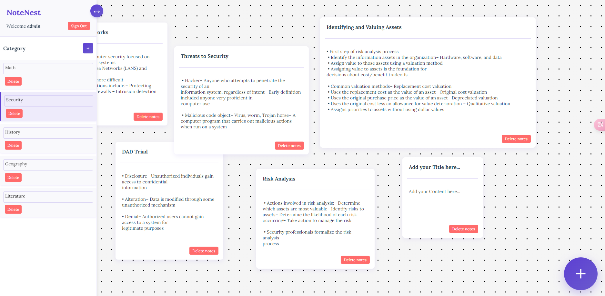
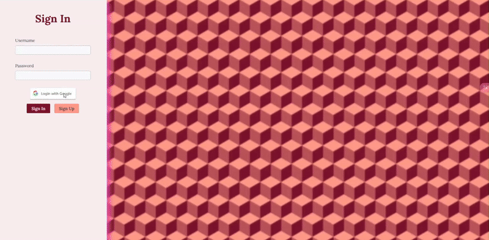

# NoteNest


## Demo-1


## Demo-2


## Project Structure
```
└── Notes/
    ├── Backend/
    │   ├── config/
    │   │   ├── email.js
    │   │   └── passport.js
    │   ├── controllers/
    │   │   ├── controllerAccount.js
    │   │   ├── controllerCategory.js
    │   │   ├── controllerImages.js
    │   │   └── controllerNotes.js
    │   ├── db/
    │   │   └── db.js
    │   ├── middlewares/
    │   │   └── middlewares.js
    │   ├── models/
    │   │   ├── account.js
    │   │   ├── category.js
    │   │   ├── images.js
    │   │   ├── notes.js
    │   │   └── verification.js
    │   ├── routes/
    │   │   ├── routesAccounts.js
    │   │   ├── routesCategory.js
    │   │   ├── routesImage.js
    │   │   └── routesNotes.js
    │   ├── server.js
    │   └── .env
    ├── Frontend/
    │   └── src/
    │       ├── css/
    │       │   ├── app.css
    │       │   ├── index.css
    │       │   ├── login.css
    │       │   ├── notification.css
    │       │   └── register.css
    │       ├── js/
    │       │   ├── app.js
    │       │   ├── canvas.js
    │       │   └── notification.js
    │       ├── app.html
    │       ├── index.html
    │       ├── login.html
    │       └── register.html
    ├── .gitignore
    ├── package-lock.json
    └── package.json
```
    
### Full-stack Notes app

Learning full stack,  making notes app using html, css, js, expressJs and mongoDB.
